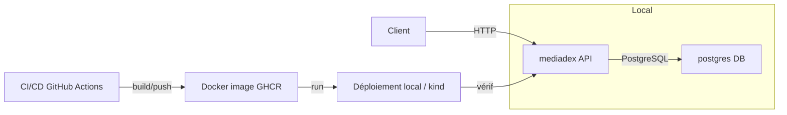

# Note d'architecture

## 1. Contexte
Mediadex-API est une API de gestion de médias destinée à stocker et organiser des médias, des collections, des tags et des utilisateurs. L’objectif métier est de proposer un service léger pour suivre sa progression et conserver un historique de contenus multimédia.

Contraintes : équipe réduite, délais courts, environnement local basé sur Docker Compose et validation de la stratégie de déploiement via kind/Kubernetes.

## 2. Vue des services

- `mediadex`
  - Rôle : API back-end REST
  - Image / stack : Go 1.26.4 / chi / gorm / Dockerfile multistage
  - Port : 8080

- `postgres`
  - Rôle : base de données relationnelle
  - Image / stack : PostgreSQL 18.2-alpine
  - Port : 5432

## 2.1 Schéma d’architecture

## 3. Flux principaux

Client → API (`mediadex`) → PostgreSQL

- Le client HTTP appelle directement l’API Go.
- L’API utilise `gorm` pour accéder à PostgreSQL.
- Les données métier (médias, collections, tags, utilisateurs) sont lues/écrites dans la base.
- CI/CD intervient entre le dépôt et l’environnement de déploiement : tests, build d’image Docker, push registre et déploiement.

## 4. Choix d'orchestration

- Docker Compose pour le développement local : lancement simple des services `mediadex` et `postgres`.
- Kubernetes via kind pour valider la stratégie de production et simuler le déploiement multi-replica.

Stratégie envisagée :
- Déploiement Kubernetes pour l’API avec rolling update

## 5. Workflow Git

- Développement sur une branche `feat/dockerfile`.
- Validation locale du Dockerfile et du build avant tout merge.
- Création d’une PR vers `main` pour revue et intégration.
- La PR sert de point de contrôle : revue de code, tests et validation du build avant fusion.
- Ce flux améliore la reproductibilité en isolant la modification Docker, puis en la validant via le pipeline.

## 6. CI/CD

- Outil : GitHub Actions
- Pipeline actuel :
  1. Checkout du code
  2. Installation de Go
  3. Exécution de `golangci-lint`
  4. Exécution des tests `go test ./...`
  5. Login sur GHCR (`ghcr.io`) via `docker/login-action`
  6. Build et push de l’image Docker vers `ghcr.io/<repo>:latest`

- Secrets / identifiants :
  - `GITHUB_TOKEN` utilisé pour s’authentifier sur GHCR
  - Variables d’environnement sensibles gérées via GitHub Secrets pour l’exécution en local / Compose : `POSTGRES_USER`, `POSTGRES_PASSWORD`, `POSTGRES_DB`, `JWT_SECRET_KEY`, `PORT`

## 7. Observabilité

- Logs : sortie standard des conteneurs Go et PostgreSQL.
- Métriques / santé : actuellement, l’application utilise un healthcheck Docker dans le `Dockerfile` qui teste `/` sur le port 8080, et `docker-compose` vérifie la santé de PostgreSQL.

## 8. Limites connues

1. Architecture de monitoring basique en S5 : pas de stack de métriques ou de logs centralisée.
   - Amélioration : ajouter Prometheus, Grafana et Loki.

2. Sécurité minimale : pas de gestion avancée des secrets ni de TLS.
   - Amélioration : utiliser un gestionnaire de secrets externe et configurer HTTPS/TLS.